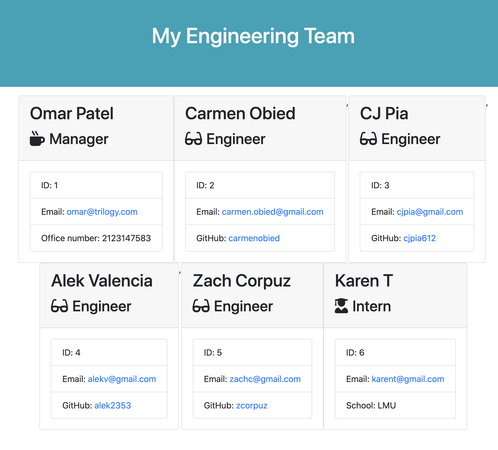
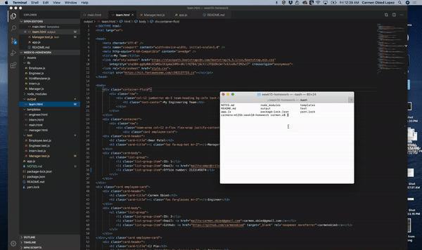
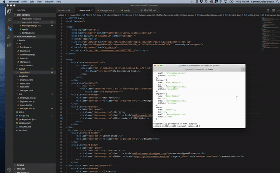
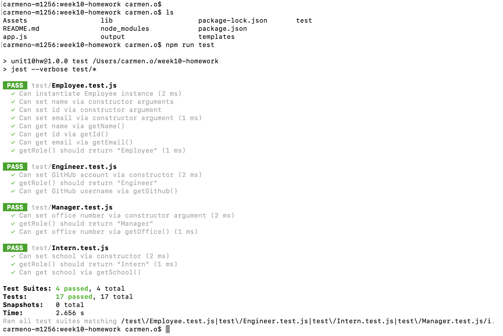

# OOP: Template Engine - Employee Summary


The goal was to build a Node CLI that takes in information about employees and generates an HTML webpage that displays summaries for each person. Since testing is a key piece in making code maintainable, the goal was also to ensure that all unit tests pass. One of the most important aspects of programming is writing code that is readable, reliable, and maintainable. Oftentimes, *how* we design our code is just as important as the code itself. Overall, the goal was to create a functional app where a user can use the CLI to generate an HTML page that displays information about their team, in which all tests must pass.

## User Story
```
As a manager
I want to generate a webpage that displays my team's basic info
so that I have quick access to emails and GitHub profiles
```

## Process
The process involved building a software engineering team generator command line application. The application prompts the user for information about the team manager and then information about the team members. The user can input any number of team members, and they may be a mix of engineers and interns. A goal was also to ensure it passes all unit tests. When the user has completed building the team, the application creates an HTML file that displays a nicely formatted team roster based on the information provided by the user. 

## Installation
```
i. Fork the Github repository.
ii. Clone the forked repo into your local machine using gitbash/terminal to pull the project and data.
iii. Access the files and assets via Visual Studio to view the code.  
iv. Run tests `npm run test`.
v. Create or update classes to pass a single test case
vi. Repeat as necessary.

```

## Usage
```
Key Components Used:
OOP - JavaScript - Node.js - Node CLI - package.JSON - npm - inquirer - jest - TDD
```

* Below is screenshot of the application:



* Preview demo demostrating the app functionality:



See full video demostrating app functionality and tests in Assets/templateEngine_demo.mp4

## Tests
```
1. Run tests with `npm run test`
2. Create or update classes to pass a single test case
3. Repeat
```
* Demo demostrating all passed tests:





## Contributing
Pull requests are welcome. Please use the [Contributor Covenant Code of Conduct](https://www.contributor-covenant.org/version/2/0/code_of_conduct/code_of_conduct.md) and for major changes, please open an issue beforehand to discuss the changes.

## License
[MIT](https://choosealicense.com/licenses/mit/)

